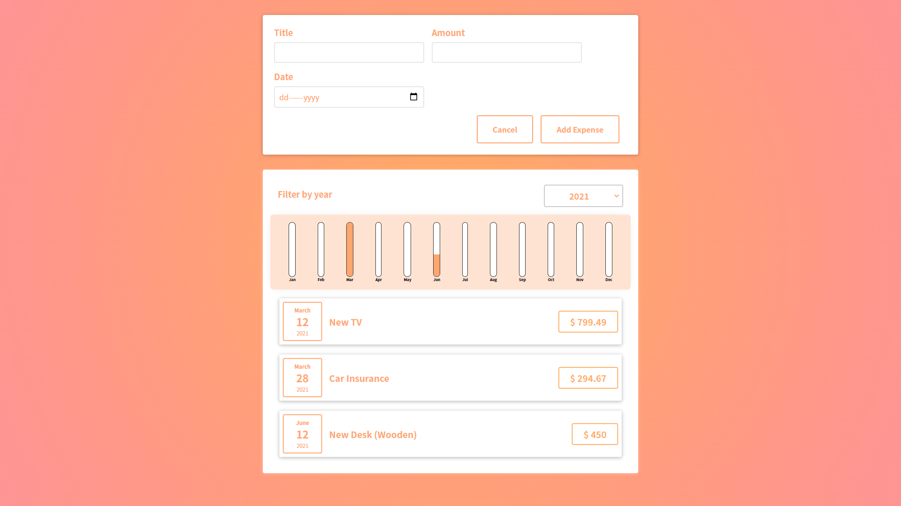

# Expense Tracker

This is my first ever React project. I made it under the guidance of Maximilian Schwarzmüller in his course "React - The Complete Guide"

Live Site URL: [https://expense-tracker-1hanif1.netlify.app/](https://expense-tracker-1hanif1.netlify.app/)

## Screenshot

## Features

- Add new Expenses
- View all Expenses
- Bar chart for expenses in a year

## How to set up

- run `npm install` in project directory
- run `npm run start` to start development server

## What I learned

- React library basics
- React Components
- React DOM
- about `create-react-app`
- state management using `useState()` hook

## Socials

🐦 Twitter - [@HMohammedB_](https://twitter.com/HMohammedB_)

📧 Email - hanifmohammed869@gmail.com
