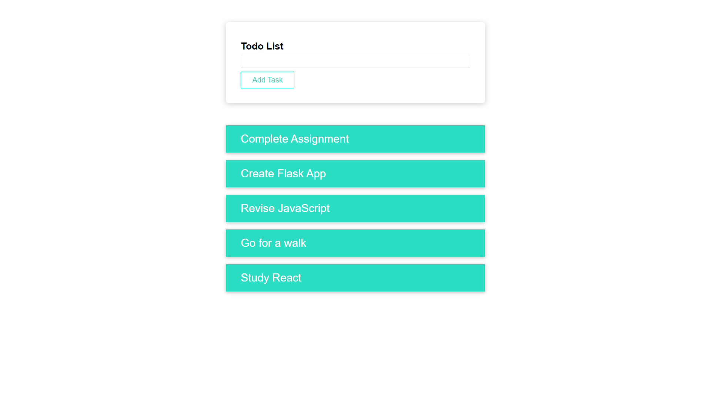

# Todo list

A React based Todo Application. In this project, I mainly learned how to apply css in different ways for components. I made it under the guidance of Maximilian Schwarzmüller in his course "React - The Complete Guide"

Live Site URL: [https://react-todo-1hanif1.netlify.app/](https://react-todo-1hanif1.netlify.app/)

## Screenshot

## Features

- Add New Tasks
- View all Tasks
- Delete Tasks

## How to set up

- run `npm install` in project directory
- run `npm run start` to start development server

## What I learned

- CSS Modules
- Basics of Styled components
- Different ways to write CSS for Components

## Socials

🐦 Twitter - [@HMohammedB_](https://twitter.com/HMohammedB_)

📧 Email - hanifmohammed869@gmail.com
