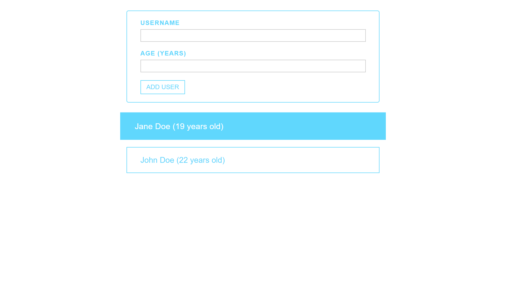

# Todo list

This is my first complete react project I built from scratch without any help, It is very simple but the modal logic was challenging. Project idea was given by Maximilian Schwarzmüller in his course "React - The Complete Guide"

Live Site URL: [https://user-list-1hanif1.netlify.app/](https://user-list-1hanif1.netlify.app/)

## Screenshot

### Main page

## Modal window

## Features

- Add New new user
- View all users
- Error handling

## How to set up

- run `npm install` in project directory
- run `npm run start` to start development server

## What I learned

- CSS Modules
- Refresher on React basics
- Changing state from child component
- Creating Reusable UI components

## Socials

🐦 Twitter - [@HMohammedB_](https://twitter.com/HMohammedB_)

📧 Email - hanifmohammed869@gmail.com
